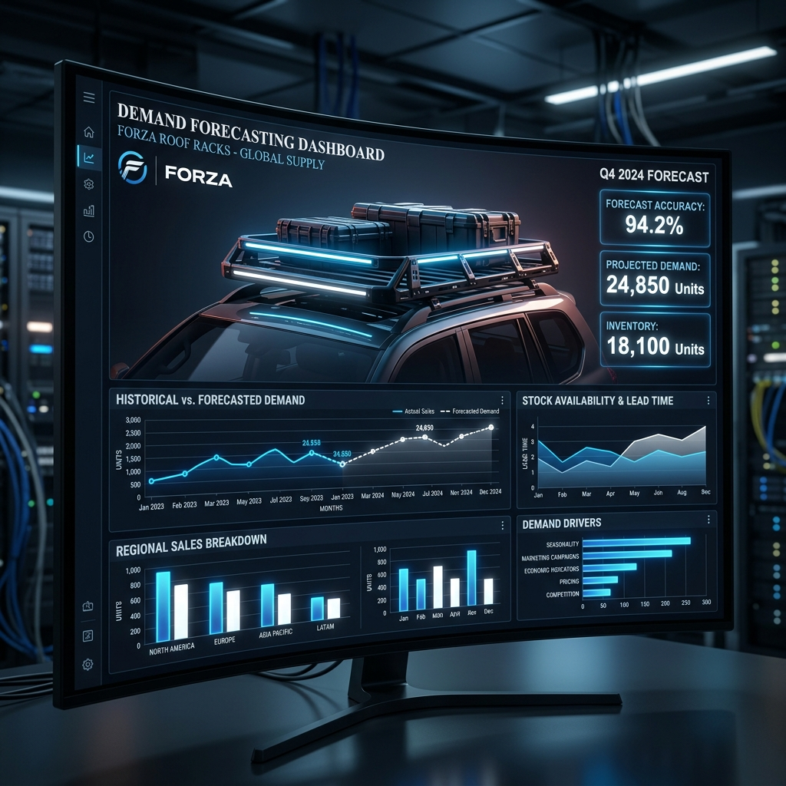

# Predicción de Demanda Inteligente: El Reto CRUZBER 📈
### Master in Data Analytics & AI (MDA13) - Proyecto Troncal

## 🚀 Visión General
Este proyecto desarrolla un sistema avanzado de **Forecasting de Demanda para CRUZBER**, líder en soluciones de transporte industrial. El objetivo central es optimizar la cadena de suministro mediante la predicción precisa de ventas en un entorno B2B caracterizado por una alta variabilidad y la presencia de "cisnes negros" (pedidos masivos repentinos).

A lo largo de **23 iteraciones de modelado**, hemos evolucionado desde modelos estadísticos básicos hasta una arquitectura híbrida capaz de gestionar tanto el flujo estable como la demanda intermitente y "lumpy".

## 🛠️ Innovación Técnica
No nos limitamos a un modelo estándar. Hemos implementado un ecosistema de soluciones adaptadas:

*   **Segmentación Syntetos-Boylan**: Clasificación automática del catálogo en categorías *Smooth*, *Erratic*, *Intermittent* y *Lumpy* para aplicar la estrategia óptima a cada SKU.
*   **Modelado Híbrido "Quirúrgico"**: Combinación de **CatBoost** con funciones de pérdida de **Tweedie** y técnicas de **Outlier Capping** (Percentil 99.5) para domar la larga cola de productos B2B.
*   **Ingeniería de Características Avanzada**: Inclusión de efectos calendario (festivos, días comerciales), lags temporales dinámicos y métricas de recencia.
*   **Optimización Bayesiana**: Fine-tuning hiper-preciso mediante **Optuna** para maximizar la generalización del modelo.

## 📊 Resultados e Impacto
*   **Precisión Crítica**: Logramos un **WMAPE del 24.0%** en el segmento de productos estables.
*   **Estabilidad en Lumpy**: Mejora sustancial en la predicción de demanda intermitente, superando el escollo del 50% de error que presentaban los modelos tradicionales.
*   **Visión Táctica**: Predicciones sólidas a horizontes de **8 y 12 semanas**, permitiendo una planificación logística real.

## 🗺️ Estructura del Proyecto
El repositorio sigue un flujo lógico de desarrollo:

1.  **Exploración y Estrategia**: `00_Estrategia_Datos_y_Decision_Nacional.ipynb`
2.  **ETL y Dataset Maestro**: `01_Creacion_Dataset_maestro.ipynb` a `02_Generacion_dataset_modelo.ipynb`
3.  **Ciclo de Iteración (1-23)**: Evolución del modelo documentada paso a paso en los notebooks `03` a `23`.
4.  **Resumen Ejecutivo y Decisiones**: `24_Resumen_Ejecutivo_21_23.ipynb` y `20_Decisiones_negocio.ipynb`.

## 💻 Stack Tecnológico
*   **Lenguaje**: Python 3.13
*   **Machine Learning**: CatBoost, Scikit-learn, XGBoost
*   **Optimización**: Optuna, Distfit
*   **Análisis**: Pandas, NumPy, Matplotlib, Seaborn
*   **Estrategia**: Metodologías Ágiles de Experimentación (A/B Testing de Modelos)

---

> [!NOTE]
> Este proyecto forma parte del proyecto troncal del **MDA13 de ISDI**.
>
> **Autor**: Gonzalo G.
